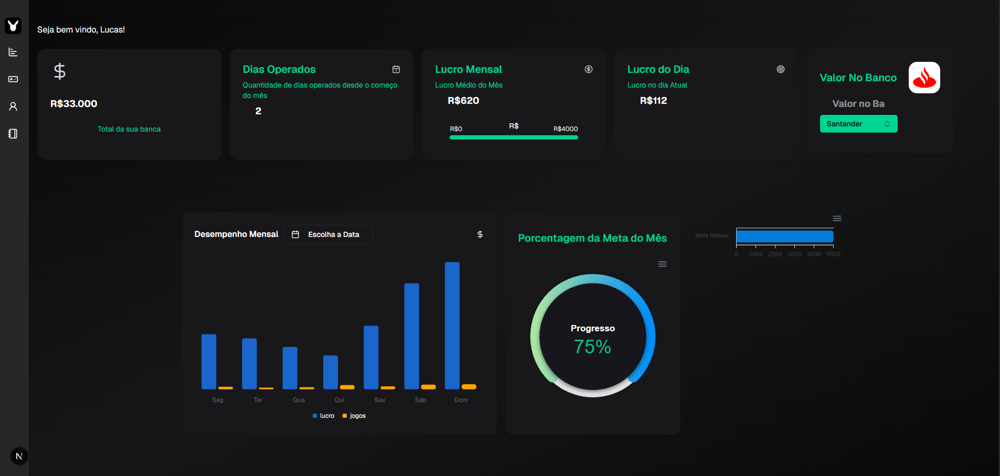
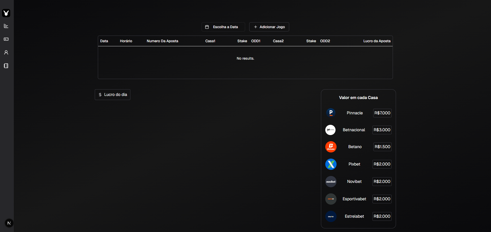
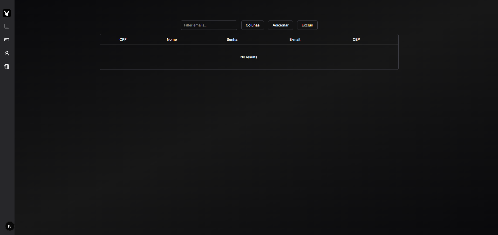

# Projeto em [Next.js](https://nextjs.org)

## Tecnologias Utilizadas 💻:

- Next.js
- HTML e TailwindCSS
- JavaScript
- Shadcn.UI
- GitHub

## Projeto:

**Dashboard ArbiMakerBrasil** é um HUB gerenciador da operação de arbitragem esportiva, com planilhas, gráficos, tabelas e cards. Contém dados importantes para o gerenciamento do usuário.

[🔗 LINK para prévia do Dashboard!](https://youtu.be/F52lYQiOvwU)

### 🖼️ Imagens do Projeto:





## Instalações 🚀

-Shadcn.UI
```bash
npx shadcn@latest init